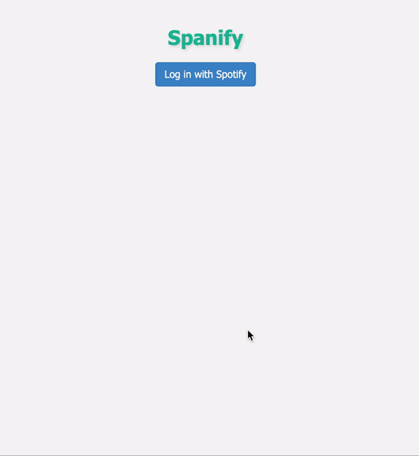

# Spanify


This is an app to help language learning by listening to translating songs line by line using Spotify. 



It makes use of the Spotify API, the [Google translate API](https://github.com/cjvnjde/google-translate-api-browser), and a [Spotify Lyrics API](https://github.com/akashrchandran/spotify-lyrics-api) created by akashrchandran.

### Deploy Spotify Lyrics API

This app relies on first deploying the Spotify Lyrics API, following [this page](https://github.com/akashrchandran/spotify-lyrics-api). It requires that you obtain a private session cookie from open.spotify, the process is described [here](https://github.com/akashrchandran/syrics/wiki/Finding-sp_dc).

Alternatively, you can host it as a Docker container using the docker image I created for the php app:

```bash
docker pull abigutai/spotify-lyrics-app
docker run -d -p 8000:80 -e SP_DC={your_SP_DC} abigutai/spotify-lyrics-app
```

### Deploy Spanify App

Obtain client_id and client_secret from your Spotify app. To deploy locally, either export these as environmental variables or replace these variables in app.js. Then run with `npm start`.

Alternatively, you can deploy this app as a docker image using:

```bash
docker pull abigutai/spanify
docker run -d -p 8888:8888 -e client_id={your_client_id} -e client_secret={your_client_secret} abigutai/spanify
```

### Using the App

To use, first open Spotify to play a song you wish to learn from. Go to [`localhost:8888`](http://localhost:8888) and login with the button, follow the directions on the Spotify authorisation page until you’re redirected to the app. 

The app will play each line of lyrics on Spotify with the option for you to replay to go to previous to next line. For the listening exercise, type what you hear and press enter, and your answer will highlight green for correct letters and red for incorrect letters. This is a simple sentence checking algorithm which is only sensitive to up to 4 letter additions or omissions before marking the rest of the sentence incorrect. For the reading exercise, type your translation and the correct translation will appear once you click enter to compare you answer.
